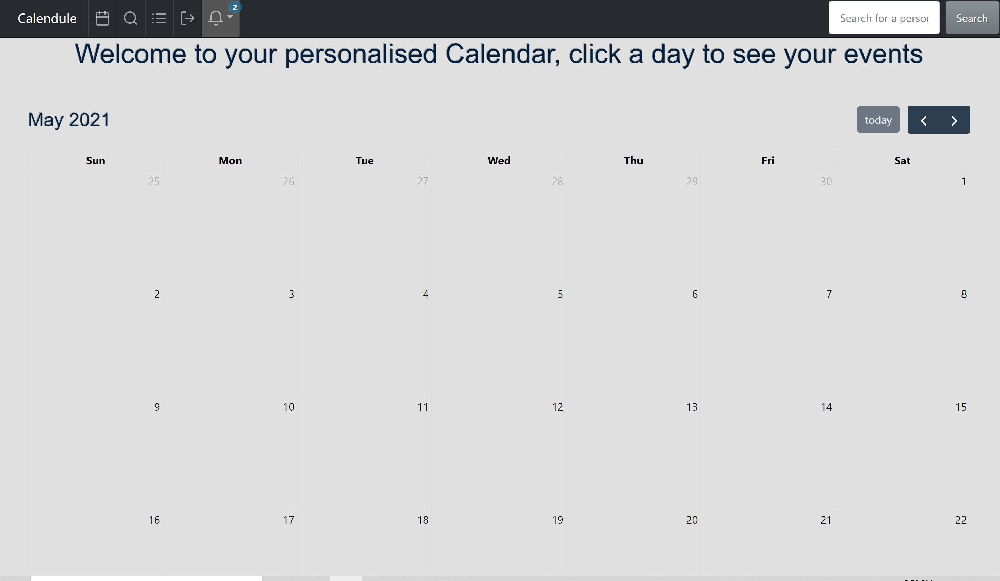

# Calendule

## Presentation

https://docs.google.com/presentation/d/1lx-sA5FdoP7cK5oML7poSK_Uq0tzBneId4iWppzuUUw/edit#slide=id.gdd614ffd98_0_81

## Demo

https://calendule.herokuapp.com/

## Table of Contents

- [Description](#description)
- [Installation](#installation)
- [Usage](#usage)
- [Contributors](#contributors)
- [Test](#test)
- [Credits](#credits)
- [License](#license)
- [Questions](#questions)

## Description:

This project allows users to keep track of their events while also providing the option to schedule activities with other people all in one spot. This ensures efficient scheduling methods reducing the amount of time spent trying to keep track of everything.

## Installation:

    User information and events are stored in the MySQL database, this allows users to add, update and cancel events and also rescheudle events. User's can choose to accept, reject or reschedule events that are added to their calendar by someone else and once accepted can be seen by the user and organised effectivley.

## Usage:

    The purpose of Calendule is to make it easier to use calendars as scheduling devices by reducing the tediousness of having to add everything scheduled into your calendar as it all being done at the same time.

The above two images show what the page looks like on our dashboard and post pages. The below image is an exmaple of code written for the application showing getting bookings data and also some front end code.

## Contributors:

[Ben Cyna](https://github.com/bencyna/)

## Test:

    Go to https://calendule.herokuapp.com/

## Credits:

@materials-ui
@fullCalendar
@facebook

## License:

      For additional information about the License, click the link below.

- [License](https://opensource.org/licenses/MIT)

## Questions:

      If you have any questions about the Calendule project, you can follow the link below to navigate to my GitHub page:

- [GitHub Profile](https://github.com/bencyna)

For further information on this project, if you'd like to discuss changes or work together - please reach out directly to: https://www.linkedin.com/in/bencyna567/.
